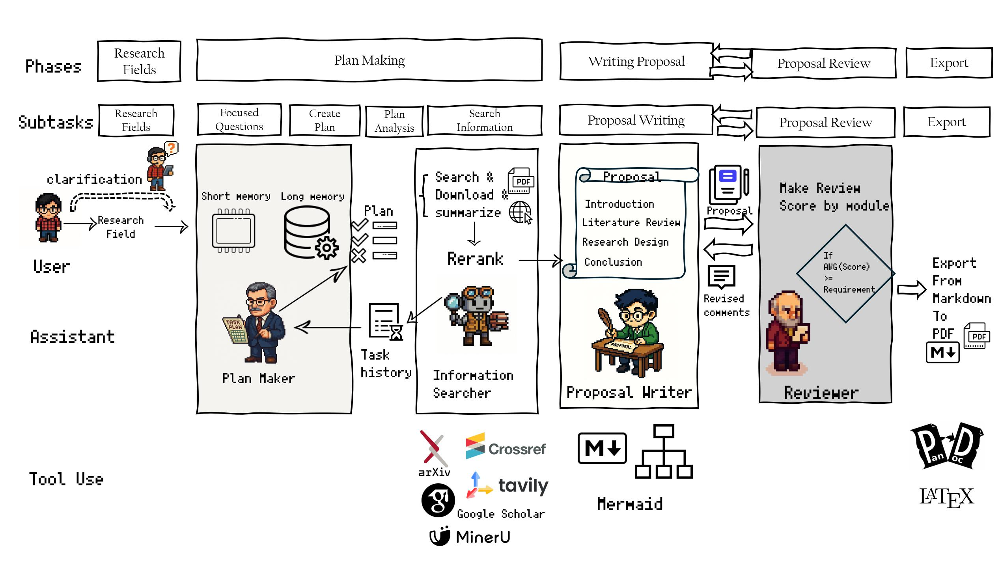

<p align="center">
  
</p>

<p align="center">
  <strong>Agent that make Research Proposals</strong>
</p>

# ProposalAgent
A Proposal Agent for Advanced AI Course in HIAS
# Team Member
郑锐、谢秋云、樊彬峰、禚宣伟、吴业阳

----
# 初步计划
## 项目简介
Proposal‑Agent 是一套用于 **自动生成并迭代优化科研计划书（Research Proposal）** 的多智能体系统。  
用户仅需输入 **研究领域 / 方向**，系统即会：

1. 检索最新文献与公开数据；
2. 产出包含 **研究背景、目标、方法、时间规划、预期成果** 等要素的完整 Proposal（PDF 形式导出）；
3. 通过 Reviewer‑Agent 按多维指标打分并给出改进意见，自动迭代直至平均得分达到设定阈值。

## Feature
- 🔍 引入多源学术数据库检索（ArXiv / IEEE Xplore）
- 🗣️ 支持通过澄清式反问来精确聚焦研究方向
- 🧠 内置长短期记忆机制，实现跨会话学习与上下文压缩
- 🤖 已实现Reviewer-Agent评审系统，支持多维度评分与修订建议
- 🌐 支持多语言 Proposal 输出

<p align="center">
  
</p>

# Requirements
- `python>=3.10`
- `uv`: Install uv as python project manager from [here](https://github.com/astral-sh/uv)
- `xelatex`

# Installation
1. Clone the repository
```bash
git clone https://github.com/Rayzheng227/ProposalAgent.git
cd ProposalAgent
```
2. Sync virtual enviroment by uv
```
uv sync
```
此命令会自动安装 `pyproject.toml` 中定义的所有依赖，包括新增的 `langchain-chroma` 和 `sentence-transformers`。

3. 运行简单的DEMO
```
uv run agent.py
```
4. 若后续开发有增加所需的库等操作，执行`uv add xxx`，如`uv add numpy`，会自动在`pyproject.toml`中以及`.venv`中增加相关库

5. 在环境变量(.env)中，导入自己的DASHSCOPE_API_KEY和TAVILY_API_KEY。

# 开发日志
(日后有新的功能更新啥的可以写到这里)


- 2025.6.8 : 增加了新的反问功能，现在针对提出的简单的研究方向/领域，Agent能够对研究的方向和领域提出相关问题。因为发现到在之前的demo中，Agent提出的规划有些既要又要了；加入了反问后，Agent能够**更好的去理解用户的意图**。
- 2025.6.9 : Merging from wyy: 后端接口以及对tools的优化

- 2025.6.9 ：通过**短期记忆（会话摘要）** 和 **长期记忆（向量数据库）** 机制实现了记忆管理。

- 2025.6.10: 实现了完整的ReviewerAgent评审系统，包括：
  - 多维度评分标准（结构完整性、学术严谨性、方法适当性等）
  - 客观定量分析（章节比例、引用密度等）
  - 评审报告生成（优势、不足、改进建议）
  - review.py和improve.py脚本提供评审和改进流程


- 2025.6.9 : 增加了检索后优化，重排序技术(RAG)

- 2025.6.12: 加入了导出pdf的实现，通过转换成latex再编译实现；Latex的模板位于exporter/文件夹下；
运行`uv run export2.py`能够导出最近的一篇文件（存在output文件夹下的）

----

# 写给队友看的一些临时的想法

1. pdf/其他格式导出的部分 ————————————>str(由md组成)
2. **加入Reviewer相关部分**————接收人类标注的结果(结构、内容)
3. 前端webui,可参考
4. (maybe)加入中间的反思
5. 加入其他搜索源

## How to use it?
【2025.6.4】 重构了一下代码，让他更模块化了；
- `/backend/src/agent/graph.py` ：这个部分是整体的Langgraph框架
- `/backend/src/agent/state.py` ：这一部分存储框架所需要的属性，如：在框架中增加了中间输出，则也需要到state中增加
- `/backend/src/agent/tools.py` : 这一部分存储的是Proposal Agent本身需要去使用的工具，若工具有变动，记得修改同目录下的tools.json
- `agent.py` ： 一个简单的DEMO，演示如何去通过ProposalAgent生成一个完整的Proposal
- `output` : 存储导出的markdown文件
- `Papers` : 存储Agent中途从Arxiv下载的论文，在概括文章时需要
- `backend` ：整体存储整个后端的内容
- `frontend` : 包含前端信息


比如说，想要输出pdf的结果更好，如：**针对Proposal的时间线**，写了一个绘图的可视化工具，可以先通过`@tools`装饰器在`tools.py`中加入新函数，再在需要用到的图的节点中加入相关说明，即可让Agent在对应阶段能够去调用该工具。

## 目前已知的一些不足：
1. ***搜索策略、搜索源问题***：Arxiv的搜索策略有一些不足，我运行了几次发现老是搜索到同一批文件(明明搜索的关键词不一样)；或许可以：**改善搜索策略**、**增加搜索源**(并不是所有论文在Arxiv上都有对应预印本；我之前加入了一个CrossRef，在网上看到说是他不需要注册API，但是我自己用的时候偶尔会出错)；
2.***输出问题***：*最终输出pdf的部分有问题(我已经写了一个export.py)，目标是将markdown文件转化为pdf，但是在中文显示、整体布局等上面有问题，可以整体去修改，目标是：读取`output`文件夹下的md文件，转化为pdf(或是其他更好阅读的格式)。这一方面可以参考`WeasyPrint`这一个库，据说是能将html文件转化为pdf，效果会更好看；或者说你有其他办法能够最终生成一个`更好阅读的格式`（word、pdf、ppt等都可以）
3. ***可视化问题***：如上所述，整体最后的输出结果缺乏一些图片等，这会显得我们的Proposal有点小小的尴尬，也许可以加入一些其他的内容(反正就是让整体Proposal更好看一点)
4. ***前端相关***构建前端，即WebUI相关，可以参考:[这里](https://github.com/google-gemini/gemini-fullstack-langgraph-quickstart.git)，这个仓库的frontend部分提供了一个我看着感觉很高级的webUI，所有的中间输出相关，基本上都在`Graph.py`中，中间输出内容基本上以`logging.info`为主，可以捕获这些输出去做前端。
5. ~~***Reviewer—强化输出***按照我们讨论的，可以加入一个Reviewer，去对我们生成的Proposal进行评分，然后返回给ProposalAgent进行改善~~ **已实现ReviewerAgent功能**：已完成独立的ReviewerAgent模块，能够对研究计划书进行多维度评分、分析优缺点并提供具体修订建议。通过review.py和improve.py脚本实现了评审->改进流程。目前已支持完整研究计划书评审和针对特定章节的评审功能。
6. ***工作量上***(或者说，涉及的知识点范围），若要涉及到更多的现有技术，可以考虑**MCP**,**RAG**；其中MCP相关的内容是作为tools的一部分；比如说：如果有对应的生成、修改最终格式的MCP，那应该是挺不错的； **RAG**【已优化】上，我思考了一下可以加入到数据库的内容，比如说,我前面提到的**搜索策略**问题，我发现，在有些情况下，Agent对专业词汇的理解不够，而且有些方面的论文，**可能在标题、关键词中没有相关的内容**，但整体的文章是关于这个方向的，这种情况下我们的搜索策略就无法搜索到对应的关键词。
7. ***反思功能***：这个可能我后面有时间自己会增加，目前的整体规划是：若网络上、Arxiv等搜索到的相关内容不超过3个，则重新搜索；但是这个方法是显然不足的，我想的一个方式是：让LLM去判断，目前收集到的资料**是否足以他了解完整的行业趋势**，将最终结果限定为一个Bool型，若为真，则截止搜索工作；若不足，则继续搜索工作。或者也许你能想到更好的策略。

8. ***记忆管理问题***：【已解决】目前没有提供一些记忆管理策略，这样会造成每次的token数很高，这在成本上是一个挑战；也许可以考虑去优化这方面的策略
   - **解决方案**：已通过**短期记忆（会话摘要）** 和 **长期记忆（向量数据库）** 机制解决。
   - **A、短期记忆（会话摘要）**
   - **问题**：在处理复杂的研究任务时，Agent 的执行步骤会越来越多，导致传递给 LLM 的上下文急剧膨胀，这不仅会超出模型的 Token 限制，还会增加推理成本。 
   - **解决方案**：我们引入了一个**摘要节点（Summarization Node）**。在 Agent 的执行循环中，每隔几个步骤（当前设置为3步），它就会自动"回顾"最近的执行历史，并生成一段高度浓缩的摘要。在后续的规划中，Agent 将使用这段摘要而非完整的历史记录，从而在保持关键信息的同时，极大地压缩了上下文长度。

   - **2. 长期记忆（跨会话知识库）**

   - **问题**：传统的 Agent 是"健忘"的，每次处理新任务都是从零开始，无法从过去的成功或失败中学习。
   - **解决方案**：我们集成了 **ChromaDB 向量数据库** 作为 Agent 的长期记忆。
   - **知识存储**：每当一个研究计划成功生成后，系统会提取其核心信息（如研究问题、关键结论、研究方法等），将其向量化并存入 `chroma_db` 文件夹内的数据库中。
   - **知识检索**：当用户提出一个新的研究问题时，Agent 会首先在向量数据库中进行相似度搜索，查找并"回忆"起过去处理过的最相关的项目。这些历史知识将作为重要参考，帮助 Agent 更好地规划当前任务，从而实现跨会话的学习和进化。


1. ***反问功能***：【已解决】这是我自己今天在用ChatGPT的时候发现的，在DeepResearch时，会进行反问，完善提问的细节，对于我们这个任务来说，输入的只是一个小小的领域，也许可以加入一个Agent反问用户，得到一些具体的细节；
   - **解决方案**：已在 `clarify_research_focus_node` 节点中实现。Agent 会在规划前，先生成澄清式问题，等待用户输入后再继续。

## 开发注意事项

希望最好能够每个功能部分pull新的分支，以免影响整体；


---

希望能够完善一下上面所述的不足!!! 


## reviewer使用
```
### 1. 使用ReviewerAgent评审已有研究计划
uv run review.py --file <.md文件路径> --field <想询问的领域问题>

### 2. 使用评审建议来重新生成一个proposal
uv run improve.py --review <.json文件路径> --original <.md原始文件路径>
```


## 现有问题
1. 每个章节生成的内容好像并接收修订指南参数的设计，导致了信息孤岛问题
2. 没有机制将具体的修订指导传达给需要改进的节点，比如write_introduction_node、write_literature_review_node等节点并不知道需要针对哪些具体问题进行改进。
3. 虽然在improve.py里会提取原始结果章节，但ProposalAgent无法访问这些内容进行比较和修改。
4. 没有机制来确保修订建议是否被真正执行。
5. 如何来比较原始和修订版本的好坏呢？

**改进进展**：已完成了基本的评审反馈流程，但需要进一步改进ProposalAgent架构，使其能够接收和处理章节级别的修订指导。当前的修订效果有限，主要由于ProposalAgent的设计是"重新生成"而非"定向修订"。

## Screep已实现前端展示部分：
- 相关源码位于/frontend/src/下
- 运行方法：
  - 1.机器上面安装node.js
  - 2.进入frontend目录，执行`npm i`下载相关依赖
  - 3.执行`npm run dev`运行网页展示
- 前端展示端口80，后端8810
- 对backend中有大量修改，对graph.py中也做了部分修改，包括流式输出与实时记录
- 目前实现的是第一版，功能已经相对完整，不包含反思节点，后续补上

