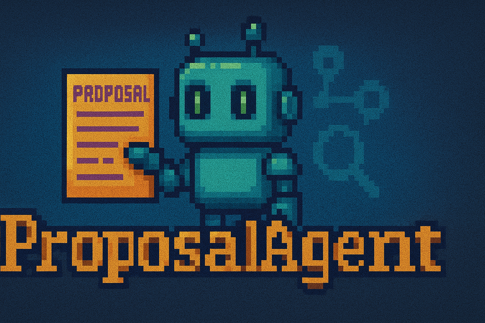

<p align="center">
  
</p>

<p align="center">
  <strong>Agent that make Research Proposals</strong>
</p>

# ProposalAgent
A Multi-Agent System for End-to-End Research Proposal Drafting and Optimization
## 👤 团队成员

郑锐、谢秋云、樊彬峰、禚宣伟、吴业阳

---


## 项目简介

用户仅需输入研究领域，系统便会：

1.  **智能检索**：深度检索多源学术数据库（如 ArXiv, CrossRef, Google Scholar）和网络内容。
2.  **分步撰写**：逐步生成包含 **研究背景、目标、方法、时间规划、预期成果** 等标准章节的计划书。
3.  **可视化集成**：自动集成 **Mermaid 图表**（如甘特图），使时间规划等内容一目了然。
4.  **自动导出**：将最终报告导出为可阅读的 Markdown 和 **PDF 形式**。
5.  **智能评审与迭代**：通过 **Reviewer-Agent** 对生成的计划书进行多维度评审，给出评分和详细改进意见，并驱动 Proposal-Agent 进行**自动迭代优化**，直至达到设定的质量阈值。

## ✨ 主要特性

*   **🔍 多源智能检索与内容收集**：支持从 ArXiv、CrossRef、Google Scholar 等学术数据库和网络内容中高效检索并收集相关文献及信息。
*   **🗣️ 澄清式反问机制**：支持通过与用户进行澄清性对话，精确聚焦研究方向和用户意图，提升规划准确性。
*   **🧠 智能记忆管理**：
    *   **短期记忆（会话摘要）**：在执行过程中定期对历史步骤进行摘要，有效压缩上下文长度，降低 LLM 调用成本。
    *   **长期记忆（向量数据库）**：集成 ChromaDB 作为知识库，存储已完成研究计划的核心洞察，实现跨会话学习和知识复用。
*   **🔄 文献智能重排序（RAG 优化）**：通过 LLM 对检索到的文献进行相关性评分和重排序，确保最相关文献被优先处理和引用。
*   **🤖 强大的 Reviewer-Agent 评审系统**：
    *   提供多维度评分标准（如结构完整性、学术严谨性、方法适当性）。
    *   支持客观定量分析（章节比例、引用密度等）。
    *   生成详细评审报告，包含优势、不足及具体修订建议。
*   **♻️ 自动迭代优化流程**：根据 Reviewer-Agent 的评审反馈，Proposal-Agent 能自动调整和改进研究计划书，直至满足质量要求。
*   **📊 Mermaid 图表集成**：自动将 Mermaid 代码块转换为图片并嵌入到最终报告中，支持项目甘特图等可视化内容。
*   **📄 自动化报告导出**：将生成的计划书内容转换为结构化的 Markdown 文件，并通过 **xelatex** 编译为高质量的 PDF 文档，支持中文显示。
*   **🌐 多语言支持**：支持生成中文研究计划书。

## 🚀 快速开始

### 1. 环境要求

*   `python>=3.10`
*   `uv`: Python 项目管理器，请从 [uv GitHub](https://github.com/astral-sh/uv) 安装。
*   `xelatex`: 用于将 LaTeX 文件编译为 PDF。
    *   Ubuntu/Debian: `sudo apt-get install texlive-full`
    *   CentOS/RHEL: `sudo yum install texlive-scheme-full`
*   `mermaid-js/mermaid-cli` (`mmdc`): 用于将 Mermaid 代码转换为图片。
    *   安装 Node.js (如果未安装)。
    *   使用 npm 安装：`npm install -g @mermaid-js/mermaid-cli`
    *   您可以通过 `mmdc --version` 命令检查是否安装成功。

### 2. 安装步骤

1.  **克隆仓库**：
    ```bash
    git clone https://github.com/Rayzheng227/ProposalAgent.git
    cd ProposalAgent
    ```
2.  **同步虚拟环境**：
    ```bash
    uv sync
    ```
    此命令会自动安装 `pyproject.toml` 中定义的所有依赖。
3.  **配置环境变量**：在项目根目录下创建 `.env` 文件，并导入您的 API 密钥：
    ```
    DASHSCOPE_API_KEY="your_dashscope_api_key"
    TAVILY_API_KEY="your_tavily_api_key"
    ```

### 3. 导出示例

您可以通过 `export2.py` 脚本来生成研究计划书并导出 PDF：

```bash
# 生成最新的研究计划书并导出PDF
uv run export2.py

# 或者，指定一个已存在的Markdown文件ID来处理（例如：Research_Proposal_1mivmw501h.md 的ID是 1mivmw501h）
uv run export2.py 1mivmw501h

# 您也可以指定提案ID（proposal_id）以便在前端追踪进度
uv run export2.py <your_markdown_file_id> <your_proposal_id>
```

生成的报告（Markdown 和 PDF）以及 Mermaid 图片将保存在 `output/` 和 `exporter/pdf_output/` 目录下。

## 📁 项目结构

*   `/backend/src/agent/graph.py`：LangGraph 框架的整体实现，定义了 Agent 的工作流和节点。
*   `/backend/src/agent/state.py`：存储 LangGraph 框架所需的状态属性，用于在不同节点间传递信息。
*   `/backend/src/agent/tools.py`：定义了 Proposal Agent 可调用的外部工具（如搜索工具、PDF 摘要工具、甘特图生成工具）。`tools.json` 存储工具描述。
*   `/backend/src/reviewer/`：包含 ReviewerAgent 模块的实现，用于评审和生成修订指导。
*   `/exporter/`：包含 LaTeX 模板 (`main.tex`) 和 PDF 导出相关的类与配置。
*   `/output/`：存储 Agent 生成的 Markdown 格式研究计划书和参考文献 JSON 文件。
*   `/exporter/pdf_output/`：编译生成的 PDF 文件和 Mermaid 图表图片 (`figures/mermaid_images/`) 存放目录。
*   `frontend/`：包含前端 Web UI 的相关代码。
*   `/backend/`:包含

## 🛠️ 核心模块与工作流

ProposalAgent 的核心工作流基于 **LangGraph** 构建，采用模块化设计，主要包含以下关键节点：

1.  **澄清研究焦点**：与用户交互，通过提问明确研究领域。
2.  **制定总体计划**：根据研究领域和澄清结果，生成一个高层次的研究计划。
3.  **分析计划与执行**：将总体计划分解为具体的工具执行步骤（如搜索论文、内容摘要），并逐步执行。
4.  **记忆管理**：
    *   **短期记忆摘要**：定期回顾执行历史并生成摘要，优化上下文。
    *   **长期记忆存储**：将最终研究成果存入 ChromaDB，支持跨会话知识复用。
5.  **章节撰写**：Agent 根据收集到的信息和规划，依次撰写引言、文献综述、研究设计、结论等章节。
6.  **参考文献管理**：自动从收集的数据中提取、编号和格式化参考文献。
7.  **报告生成与导出**：将所有章节内容整合为完整的 Markdown 报告，并编译为 PDF。
8.  **智能评审与改进循环**：
    *   **评审**：Reviewer-Agent 对生成的报告进行评分和反馈。
    *   **生成修订指导**：将评审结果转化为具体的改进指令。
    *   **应用改进**：Proposal-Agent 根据修订指导重新生成并优化报告，形成迭代改进闭环。

## 🚧 已知问题与未来展望

### 当前挑战

1.  **搜索策略与内容全面性**：
    *   现有 ArXiv 搜索可能存在局限，有时搜索结果重复或未能捕获非标题/关键词相关但内容相关的论文。
    *   考虑引入更复杂的搜索策略（如基于摘要或全文语义搜索），并进一步扩展高质量的搜索源。
2.  **细粒度修订的实现**：
    *   目前 Agent 的改进机制更多是"重新生成"而非"定向修订"，导致难以对报告的特定章节进行精准的、细节层次的修改。
    *   未来需要探索更精细的文本修改方法，例如基于 Diff 的内容对比与修正，以及将章节级别的修订指导更有效地传递给具体的撰写节点。
3.  **版本比较与评估**：缺乏直观有效的方式来比较原始版本和修订版本之间的质量差异和改进效果。
4.  **可视化与美观性**：虽然已集成 Mermaid 图表，但整体报告的视觉美观度和布局仍有提升空间。可以考虑集成更强大的渲染库（如基于 HTML/CSS 的 `WeasyPrint`）或引入更多图表类型。

### 未来展望

*   **更智能的搜索与数据集成**：实现更高级的 RAG (Retrieval Augmented Generation) 策略，优化文献检索的深度和广度。
*   **强化中间过程反思**：引入 Agent 在执行过程中的自我反思机制，使其能判断当前信息是否充足，并自主调整策略。
*   **用户交互体验优化**：在前端实现更流畅的任务进度展示、中间结果可视化以及更灵活的用户介入/调整功能。
*   **更多格式导出**：探索支持导出为 Word、PPT 等更多常用文档格式。

## 🤝 贡献

欢迎对本项目提出建议或贡献代码。请在提交 Pull Request 前，考虑为新的功能创建独立的分支。

## 📜 开发日志

*   **2025.6.8**：增加了新的反问功能，Agent 能够对研究方向提出澄清问题，更好地理解用户意图。
*   **2025.6.9**：实现了基于**短期记忆（会话摘要）** 和 **长期记忆（向量数据库 ChromaDB）** 的记忆管理机制，有效降低了上下文 Token 消耗并实现了跨会话学习。
*   **2025.6.9**：后端接口和工具优化。增加了检索后优化，实现**重排序技术 (RAG)**，提升文献相关性。
*   **2025.6.10**：实现了完整的 **ReviewerAgent 评审系统**，支持多维度评分、客观定量分析（章节比例、引用密度）、优势/不足识别和评审报告生成。`review.py` 和 `improve.py` 脚本提供评审和改进流程。
*   **2025.6.12**：加入了 PDF 导出实现，通过将 Markdown 转换为 LaTeX 再编译的方式实现。LaTeX 模板位于 `exporter/` 文件夹下。


## 🌐 前端展示部分

*   **相关源码**：位于 `/frontend/src/`
*   **运行方法**：
    1.  机器上安装 `Node.js`。
    2.  进入 `frontend` 目录，执行 `npm i` 下载相关依赖。
    3.  执行 `npm run dev` 运行网页展示。
*   **端口说明**：前端展示端口 `3000`，后端端口 `8810`。
*   **注意**：目前已实现第二版，集成了反思模块与下载模块（PDF 下载功能需后端集成后支持）。**禁止在任务执行时刷新页面**，否则可能导致状态记录丢失。

